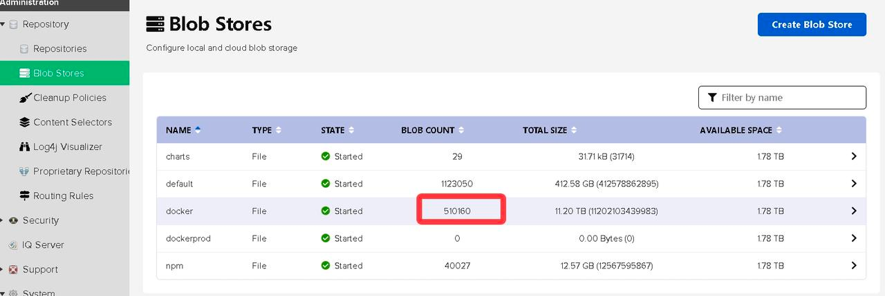
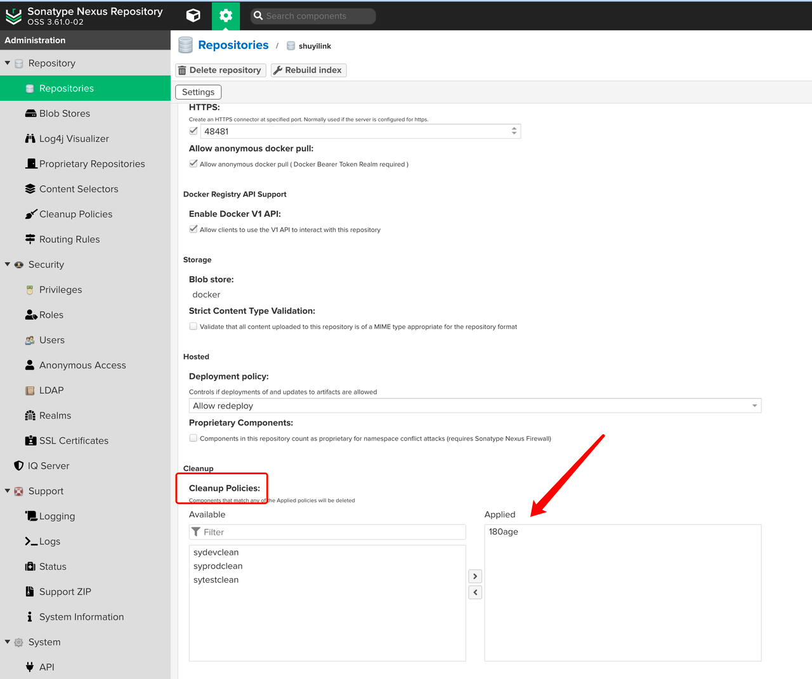
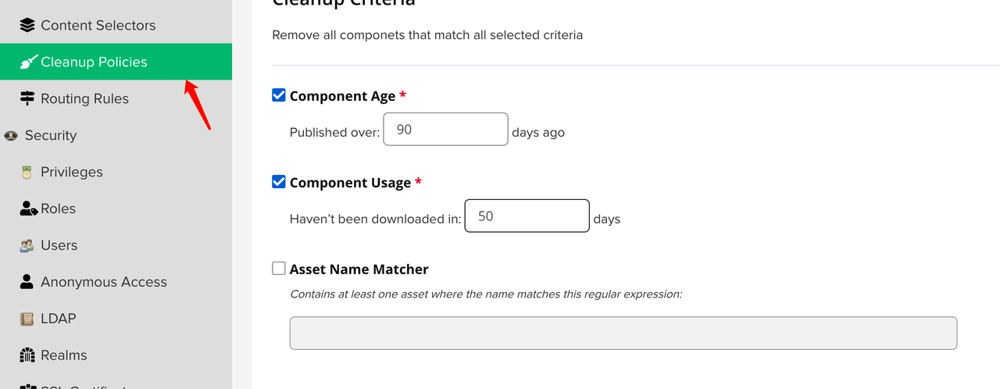
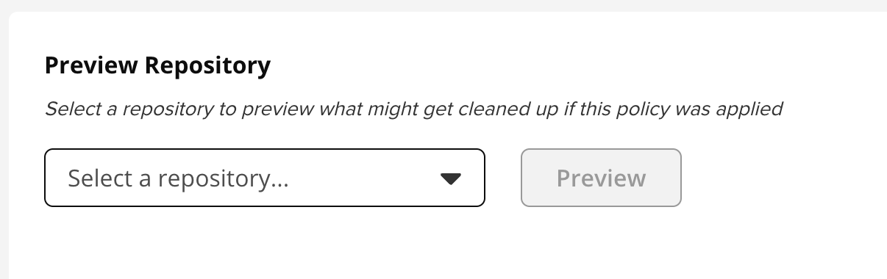
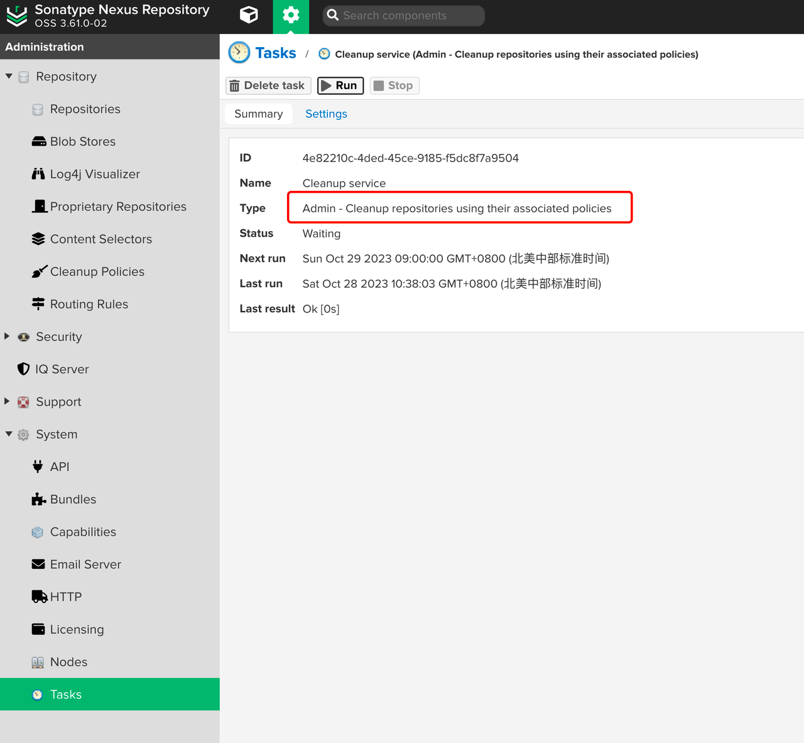
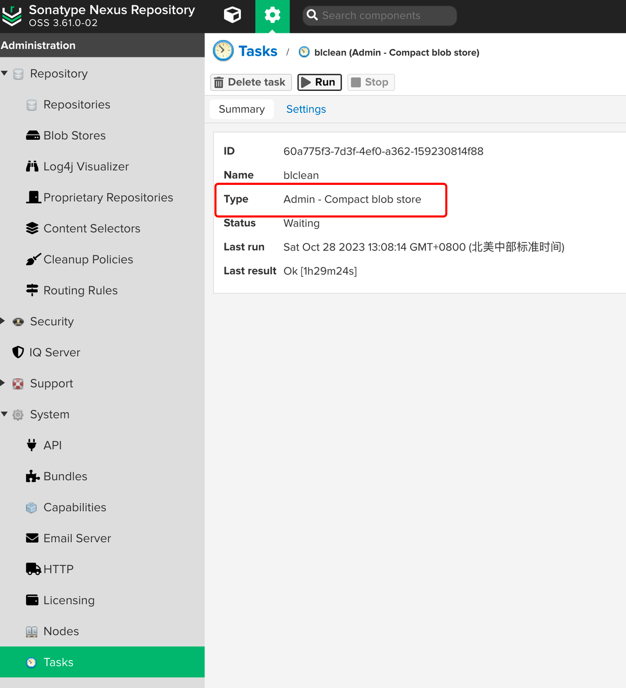

# 解决nexus docker仓库清理问题
nexus作为大一统的依赖仓库管理工具也支持docker仓库，但是他没有harbor灵活高效的清理策略，清理起来还是有坑。

## 判断哪个仓库占用空间大
https://support.sonatype.com/hc/en-us/articles/115009519847-Investigating-Blob-Store-and-Repository-Size-and-Space-Usage
## 开始清理
[官方文档](https://support.sonatype.com/hc/en-us/articles/360009696054-How-to-delete-docker-images-from-Nexus-Repository-3)
### 查看是否绑定了清理策略

### 绑定了那就可以运行清理策略了，先看看清理策略的配置
推送时间>90,最后使用>50


### 可以先预清理看一下

### 通过task运行清理任务，如果没有这个task，可以新增

### 运行任务删除孤立的Docker层


不出意外报错了
```
org.sonatype.goodies.common.MultipleFailures$MultipleFailuresException: Failed to run task 'Docker - Delete unused manifests and images'; 1 failure
        at org.sonatype.goodies.common.MultipleFailures.maybePropagate(MultipleFailures.java:95)
        at org.sonatype.nexus.repository.RepositoryTaskSupport.execute(RepositoryTaskSupport.java:90)
        at org.sonatype.nexus.scheduling.TaskSupport.call(TaskSupport.java:100)
        at org.sonatype.nexus.quartz.internal.task.QuartzTaskJob.doExecute(QuartzTaskJob.java:143)
        at org.sonatype.nexus.quartz.internal.task.QuartzTaskJob.execute(QuartzTaskJob.java:106)
        at org.quartz.core.JobRunShell.run(JobRunShell.java:202)
        at org.sonatype.nexus.quartz.internal.QuartzThreadPool.lambda$0(QuartzThreadPool.java:145)
        at org.sonatype.nexus.thread.internal.MDCAwareRunnable.run(MDCAwareRunnable.java:40)
        at org.apache.shiro.subject.support.SubjectRunnable.doRun(SubjectRunnable.java:120)
        at org.apache.shiro.subject.support.SubjectRunnable.run(SubjectRunnable.java:108)
        at java.util.concurrent.Executors$RunnableAdapter.call(Executors.java:511)
        at java.util.concurrent.FutureTask.run(FutureTask.java:266)
        at java.util.concurrent.ThreadPoolExecutor.runWorker(ThreadPoolExecutor.java:1149)
        at java.util.concurrent.ThreadPoolExecutor$Worker.run(ThreadPoolExecutor.java:624)
        at java.lang.Thread.run(Thread.java:748)
        Suppressed: java.lang.NullPointerException: Cannot get property 'digest' on null object
                at org.codehaus.groovy.runtime.NullObject.getProperty(NullObject.java:60)
                at org.codehaus.groovy.runtime.InvokerHelper.getProperty(InvokerHelper.java:190)
                at org.codehaus.groovy.runtime.DefaultGroovyMethods.getAt(DefaultGroovyMethods.java:342)
                at org.codehaus.groovy.runtime.dgm$242.invoke(Unknown Source)
                at org.codehaus.groovy.runtime.callsite.PogoMetaMethodSite$PogoMetaMethodSiteNoUnwrapNoCoerce.invoke(PogoMetaMethodSite.java:251)
                at org.codehaus.groovy.runtime.callsite.PogoMetaMethodSite.call(PogoMetaMethodSite.java:71)
                at org.codehaus.groovy.runtime.callsite.CallSiteArray.defaultCall(CallSiteArray.java:47)
                at org.codehaus.groovy.runtime.callsite.NullCallSite.call(NullCallSite.java:34)
                at org.codehaus.groovy.runtime.callsite.CallSiteArray.defaultCall(CallSiteArray.java:47)
                at org.codehaus.groovy.runtime.callsite.PojoMetaMethodSite.call(PojoMetaMethodSite.java:58)
                at org.codehaus.groovy.runtime.callsite.AbstractCallSite.call(AbstractCallSite.java:128)
                at org.sonatype.nexus.repository.docker.internal.V2Manifest.referencedDigests(V2Manifest.groovy:88)
                at org.sonatype.nexus.repository.docker.internal.orient.DockerGCFacetImpl.fetchDataForManifest(DockerGCFacetImpl.java:343)
                at org.sonatype.nexus.repository.docker.internal.orient.DockerGCFacetImpl.fetchDataForRepository(DockerGCFacetImpl.java:320)
                at org.sonatype.nexus.transaction.TransactionalWrapper.proceedWithTransaction(TransactionalWrapper.java:58)
                at org.sonatype.nexus.transaction.TransactionInterceptor.proceedWithTransaction(TransactionInterceptor.java:66)
                at org.sonatype.nexus.transaction.TransactionInterceptor.invoke(TransactionInterceptor.java:55)
                at org.sonatype.nexus.repository.docker.internal.orient.DockerGCFacetImpl.getExternalUsedLayersDigests(DockerGCFacetImpl.java:232)
                at org.sonatype.nexus.repository.docker.internal.orient.DockerGCFacetImpl.checkForReferencesInOtherRepositories(DockerGCFacetImpl.java:209)
                at org.sonatype.nexus.repository.docker.internal.orient.DockerGCFacetImpl.handleV2Assets(DockerGCFacetImpl.java:188)
                at org.sonatype.nexus.repository.docker.internal.orient.DockerGCFacetImpl.processRepository(DockerGCFacetImpl.java:117)
                at org.sonatype.nexus.transaction.TransactionalWrapper.proceedWithTransaction(TransactionalWrapper.java:58)
                at org.sonatype.nexus.transaction.TransactionInterceptor.proceedWithTransaction(TransactionInterceptor.java:66)
                at org.sonatype.nexus.transaction.TransactionInterceptor.invoke(TransactionInterceptor.java:55)
                at org.sonatype.nexus.repository.docker.internal.orient.DockerGCFacetImpl.deleteUnusedManifestsAndImages(DockerGCFacetImpl.java:100)
                at org.sonatype.nexus.common.stateguard.MethodInvocationAction.run(MethodInvocationAction.java:39)
                at org.sonatype.nexus.common.stateguard.StateGuard$GuardImpl.run(StateGuard.java:272)
                at org.sonatype.nexus.common.stateguard.GuardedInterceptor.invoke(GuardedInterceptor.java:54)
                at org.sonatype.nexus.repository.docker.tasks.DockerGCTask.execute(DockerGCTask.java:48)
                at org.sonatype.nexus.repository.RepositoryTaskSupport.execute(RepositoryTaskSupport.java:79)
                ... 13 common frames omitted
2023-10-28 02:42:03,491+0000 INFO  [quartz-15-thread-20] *SYSTEM org.sonatype.nexus.quartz.internal.task.QuartzTaskInfo - Task 'cleardocker1' [repository.docker.gc] state change RUNNING -> WAITING (FAILED)
```

**查看文档，发现这是一个版本bug，需要升级nexus版本**

https://github.com/sonatype/nexus-public/issues/142

需要升级版本

### 升级nexus版本
从3.37.3 >>> 3.61.0

不确定是否可以直接升级镜像，选择测试环境部署一个新的nexus，做测试

测试发现直接升级主功能都是正常的，直接升级生产使用的镜像，重新运行task，成功完成

### 回收磁盘空间

完成清理
## 咱们是devops当然得自动化这个过程，其实很简单的api调用
## 参考文章
https://support.sonatype.com/hc/en-us/articles/115009519847-Investigating-Blob-Store-and-Repository-Size-and-Space-Usage

https://support.sonatype.com/hc/en-us/articles/360009696054-How-to-delete-docker-images-from-Nexus-Repository-3

https://github.com/sonatype/nexus-public/issues/142