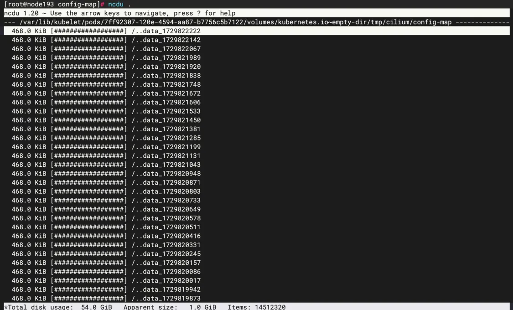

# var-lib-kubelet-pods目录大小异常
最近在k8s集群中发现/var/lib/kubelet/pods目录大小异常，这里记录一下解决过程。
## 问题
磁盘空间增速异常，使用[ncdu](xxxx)逐级查询，发现/var/lib/kubelet/pods目录下有大量的文件，占用了大量磁盘空间。
### 定位pod
pods/目录下文件ID对应pod的UUID, 可以查看目录下的containers目录，查看容器信息，大概确认是哪个pod，在我们这里是cilium的pod。   
### 分析文件
继续看目录是/var/lib/kubelet/pods/7ff92307-120e-4594-aa87-b7756c5b7122/volumes/kubernetes.io~empty-dir/tmp/cilium/config-map  占用了50G空间。

kubelet 默认使用的目录是 /var/lib/kubelet， 用于存储插件信息、Pod 相关的状态以及挂载的 volume (比如 emptyDir, ConfigMap, Secret)，通过 kubelet 的 --root-dir 参数指定。  
pod删除耗时半小时，这段时间内最好给节点打上污点，避免新的pod调度到该节点上。
## 复盘
- 磁盘增速是一项重要的监控指标，及时发现问题，避免影响业务。
- 对CNI插件的pod进行操作时需要谨慎，避免影响业务。
- 为什么会有这么多临时文件产生呢？后续需要进一步排查。