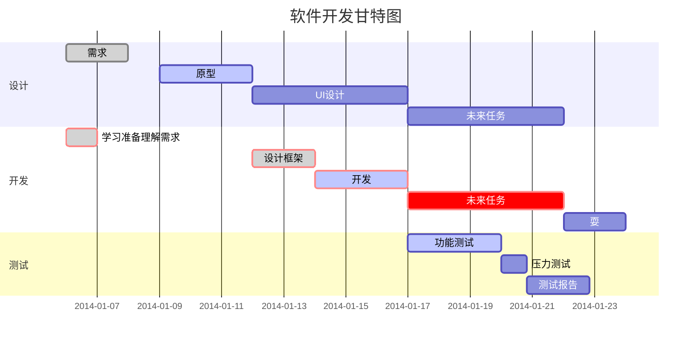
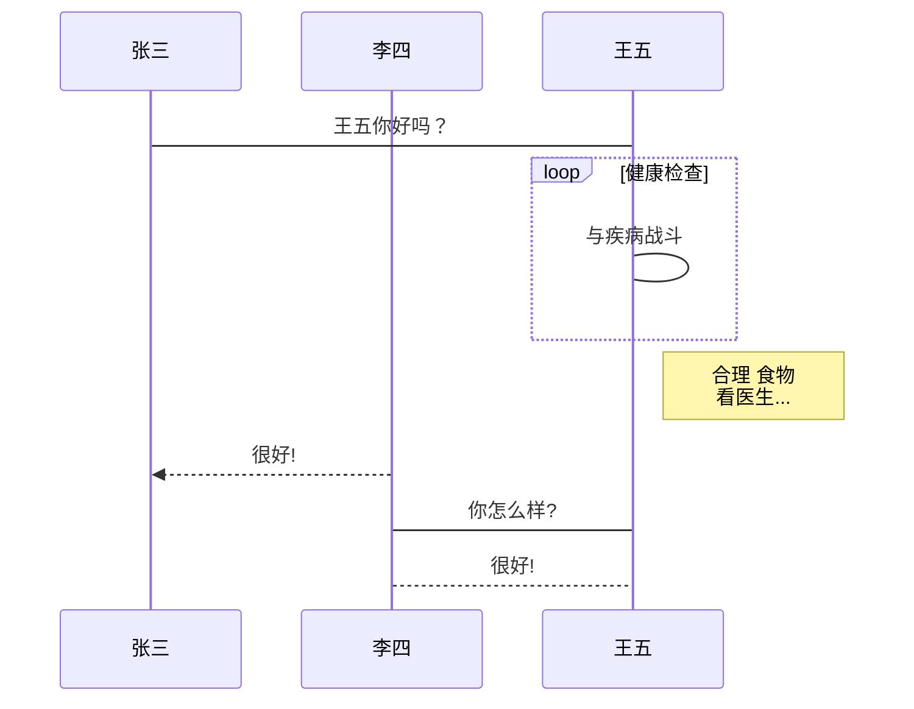
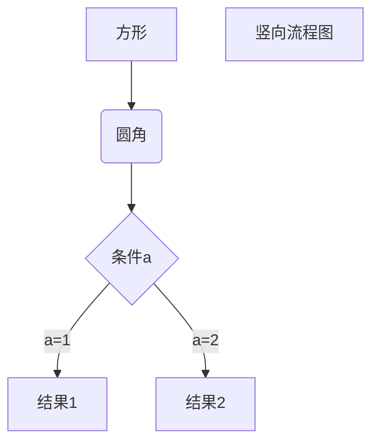
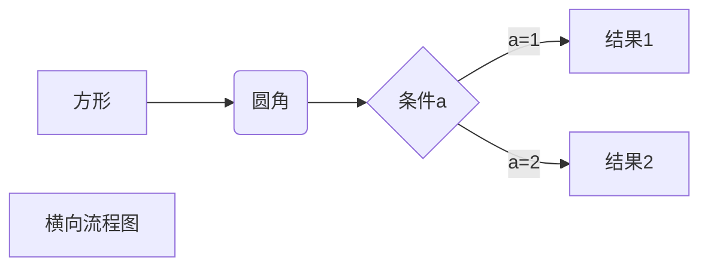

# 记录一些markdown用法
- 1 tip
::: tip 笔者说
这里的内容会独立的展示
:::
- 2 引用

> 和上面的效果类似   
> do something   
> 和上面的效果类似

- 3 换行   
在一行的末尾添加两个或多个空格，然后按回车键,即可创建一个换行

- 4 表格

- 5 甘特图

- 6 UML时序图

- 7 竖向流程图

- 8 横向流程图

- 9 表格
  |  表头   | 表头  |
  |  ----  | ----  |
  | 单元格  | 单元格 |
  | 单元格  | 单元格 |
- 10 表格对齐
  | 向左对齐 | 居中 | 向右对齐 |
  | :--- | :---: | ---: |
  | 单元格 | 单元格 | 单元格 |
  | 单元格 | 单元格 | 单元格 |
- 11 imoji表情    
  :smile: :laughing: :blush:
# 参考文章
- [markdown官方教程](https://markdown.com.cn/)
- [ljy的博客](https://www.cnblogs.com/luyj00436/p/15070274.html)
- [大量表情](https://gist.github.com/rxaviers/7360908)