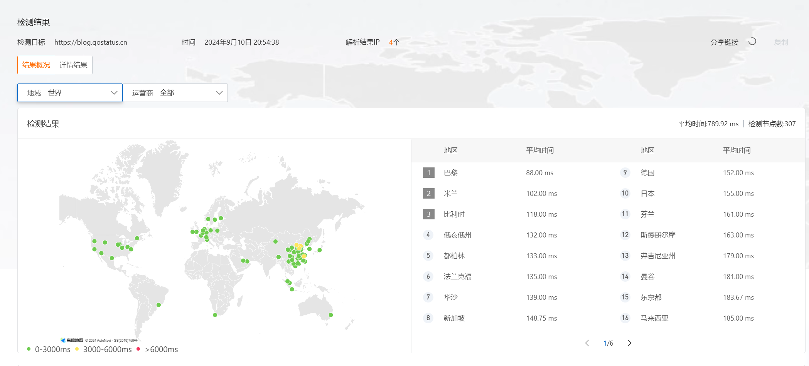
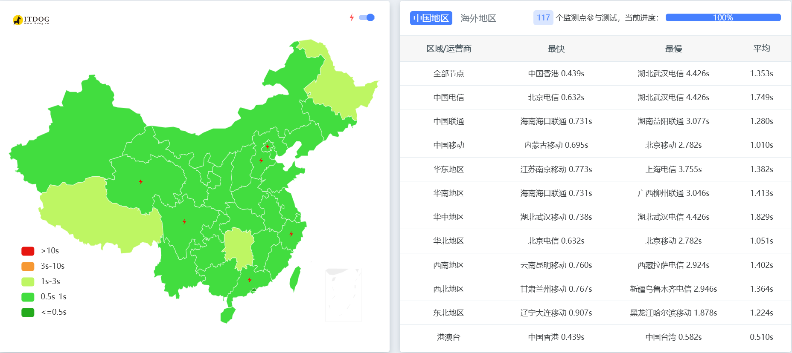

# 多地域拨测
::: tip
某些时候我们需要测试一下某个服务在不同地区的访问情况，这时候就需要多地域拨测了。
:::
## 工具
多地域往往不是我们自己的机器能够完成的，这时候我们就需要借助一些工具来完成。    
下面的工具都是覆盖到不同的地区和运营商的，可以帮助我们完成多地域拨测。
### 阿里云
https://boce.aliyun.com/detect/http   
全球200+网络拨测节点，模拟用户访问域名/IP，帮助发现网络、站点可用性问题。

### ITDOG
https://www.itdog.cn/   
节点大概120+，支持ipv4和ipv6双栈，支持全球多地域拨测，支持多种协议，支持多种运营商。

