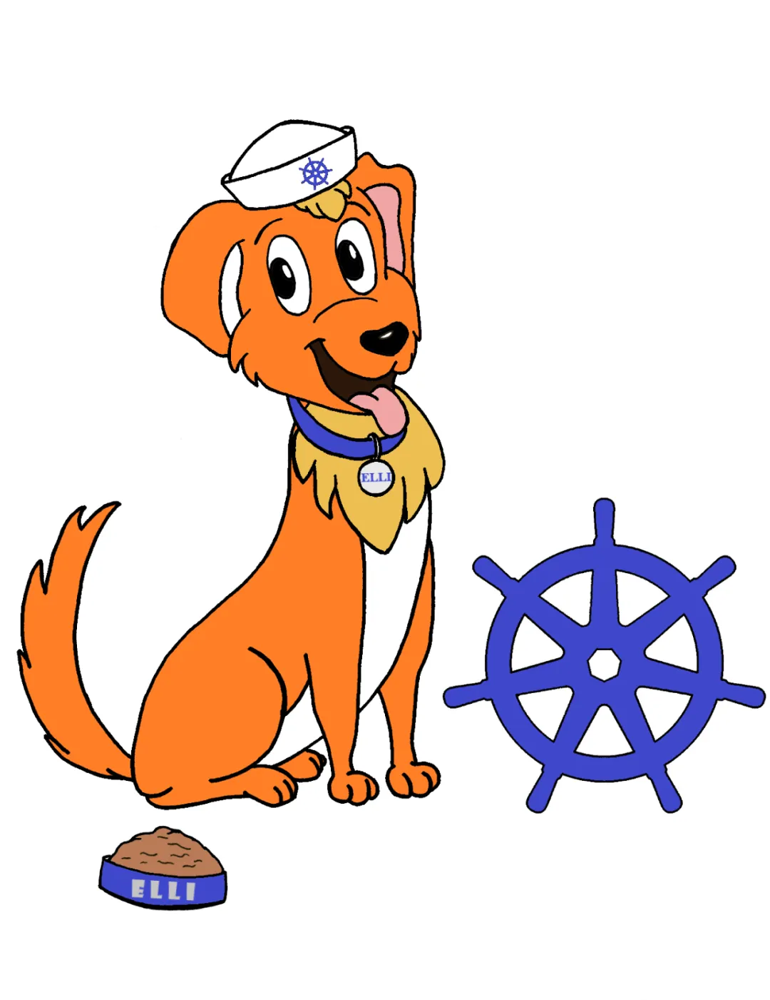

# v1.31.0版本内容
## 发布主题和徽标
这是<font color=#0000FF>10周年</font>后的第一个版本。

Kubernetes v1.31 发布主题是“Elli”。
::: tip
Kubernetes v1.31 的 Elli 是一只可爱而快乐的狗，有着一颗金子般的心和一顶漂亮的水手帽，是对庞大而多样化的 Kubernetes 贡献者家庭的俏皮眨眼。
:::


## 我认为很cool的变更
不代表真的很重要，只是我认为很有意思的变更:smiley:
### GA 和稳定的功能
GA 全称 General Availability，即正式发布。Kubernetes 的进阶路线通常是 Alpha、Beta、Stable (即 GA)、Deprecation/Removal，这四个阶段。
- KEP-3329 扩展了 Job 的字段，以配置⽤于处理 Pod 故障的作业策略。它允许⽤户确定由基础结构错误引起的某些 pod 故障，并在不增加对 backoffLimit 的计数器的情况下重试它们。此外，它还允许⽤户确定由软件错误引起的某些 pod 故障，并提前终⽌关联的作业：https://kep.k8s.io/3329
现在我们可以更灵活的操作job了
- KEP-3335 控制 StatefulSet 启动副本序号，允许在不中断底层应⽤程序的情况下迁移 StatefulSet：https://kep.k8s.io/3335
很cool，好像我们不用受制于顺序更新了，我会好好探索这个更新
### 进入 Beta 阶段的功能
Beta 阶段的功能是指那些已经经过 Alpha 阶段的功能, 且在 Beta 阶段中添加了更多的测试和验证, 通常情况下是默认启用的。
- KEP-4006 将 Kubernetes 客户端的双向流协议从 SPDY/3.1 转换为 WebSockets：https://kep.k8s.io/4006
开发pod shell的同学肯定对spdy有映像，现在他变成websocket了，会不会导致podshell的开发方式变更呢
- KEP-3857 递归的只读挂载：https://kep.k8s.io/3857
前面n个版本的修复，这个版本总算beta了
### 进入 Alpha 阶段的功能
- KEP-4639 新增基于 OCI 镜像的只读卷：https://kep.k8s.io/4639
> 引用道客的描述:
> 早在 2014 年, 社区就有人提出了类似想法, 但直到 2024 年, 借着 AI 的需求才正式加入到 Kubernetes 中
```yaml
apiVersion: v1
kind: Pod
metadata:
  name: pod
spec:
  containers:
    - name: test
      image: registry.k8s.io/e2e-test-images/echoserver:2.3
      volumeMounts:
        - name: volume
          mountPath: /volume
  volumes:
    - name: volume
      image:
        reference: quay.io/crio/artifact:v1
        pullPolicy: IfNotPresent
```
数据科学家、MLOps 工程师或 AI 开发人员可以将大型语言模型权重或机器学习模型权重与模型服务器一起安装在 Pod 中，以便他们可以有效地提供它们，而无需将它们包含在模型服务器容器映像中。他们可以将这些内容打包到 OCI 对象中，以利用 OCI 分发并确保高效的模型部署。这使他们能够将模型规格/内容与处理它们的可执行文件分开。

## 官方changelog
- 中文(https://kubernetes.io/zh-cn/blog/2024/07/19/kubernetes-1-31-upcoming-changes/)

- 英文(https://kubernetes.io/blog/2024/08/13/kubernetes-v1-31-release/)

- 道客(https://mp.weixin.qq.com/s/5329n0qpiH8L9o_wUHrs1A)
