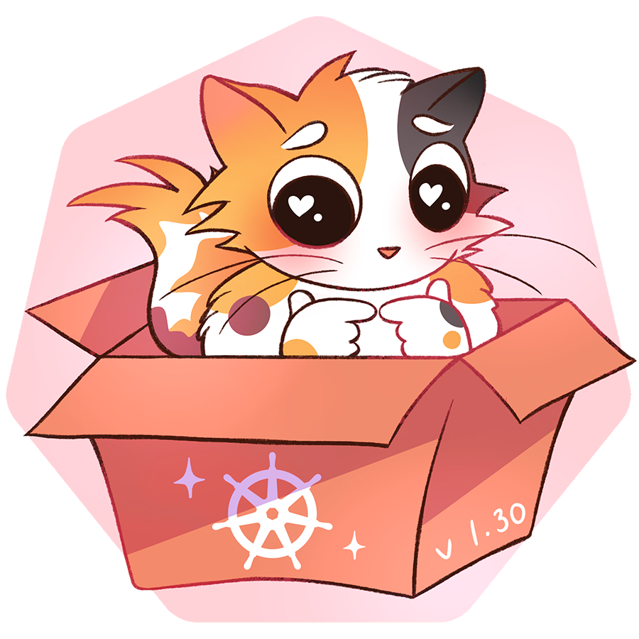

# v1.30.0版本内容
## 发布主题和徽标
这是<font color=#0000FF>2024年</font>的第一个版本。

Kubernetes v1.31 发布主题是“Uwubernetes”。
::: tip
「Uwubernetes」是由「UwU」（U 是闭合的双眸；w 是嘴巴）和「Kubernetes」组合出来的名字，在社区里，大家都会用这个表情抒发幸福或者可爱的情感。
:::



发布团队用这样的名称来感谢来自世界各地、各行各业的数千人共同构建 Kubernetes 社区及其生态，并祝愿每一位构建 Kubernetes，发布  Kubernetes，保持 Kubernetes 集群健壮在线的所有人，希望大家能像主题标志里的「furries（毛茸茸）」和她家里的猫一样生活幸福，永远可爱。


## 我认为很cool的变更
不代表真的很重要，只是我认为很有意思的变更:smiley:
### GA 和稳定的功能
GA 全称 General Availability，即正式发布。Kubernetes 的进阶路线通常是 Alpha、Beta、Stable (即 GA)、Deprecation/Removal，这四个阶段。
- kubectl 交互式删除正式发布   
  最早在 v1.27 引入，v1.29 进入 Beta 阶段，现在在 v1.30 的 kubectl 命令中已经默认支持了。
::: tip
  很多人都使用 kubectl 对集群进行更改，其中的 kubectl delete 子命令是破坏性且不可逆的命令，然而，在各种情况下，如果用户输入的命令不准确、内容和参数错误、仓促操作时都会导致集群资源误删，甚至无法还原到先前的状态的问题。

因此在 KEP-3895 kubectl delete: Add interactive(-i) flag【https://github.com/kubernetes/enhancements/issues/3895】中，ardaguclu 和社区成员提出了对 kubectl 的修改建议，提案指出，当用户将 --interactive / -i 标志传递给 kubectl delete 命令时，所有计划删除的资源将以预览的形式显示给用户。这个时候：

如果用户通过输入 y 确认，那么命令将继续删除过程；
如果用户输入 n 或 y 以外的任何其他值，删除的过程将被取消。
这样的功能类似于命令行中的[ Y / n ]提示，在 apt，yum 还有 rm 的时候都会有出现，虽然不能完全避免误操作，但是可以通过预览的方式让用户二次确认受影响的资源。
:::
### 进入 Beta 阶段的功能
Beta 阶段的功能是指那些已经经过 Alpha 阶段的功能, 且在 Beta 阶段中添加了更多的测试和验证, 通常情况下是默认启用的。
- KEP-4006 将 Kubernetes 客户端的双向流协议从 SPDY/3.1 转换为 WebSockets：https://kep.k8s.io/4006
  开发pod shell的同学肯定对spdy有映像，现在他变成websocket了，会不会导致podshell的开发方式变更呢
- KEP-3857 递归的只读挂载：https://kep.k8s.io/3857
  前面n个版本的修复，这个版本总算beta了
### 进入 Alpha 阶段的功能
- KEP-4639 新增基于 OCI 镜像的只读卷：https://kep.k8s.io/4639
> 引用道客的描述:
> 早在 2014 年, 社区就有人提出了类似想法, 但直到 2024 年, 借着 AI 的需求才正式加入到 Kubernetes 中
```yaml
apiVersion: v1
kind: Pod
metadata:
  name: pod
spec:
  containers:
    - name: test
      image: registry.k8s.io/e2e-test-images/echoserver:2.3
      volumeMounts:
        - name: volume
          mountPath: /volume
  volumes:
    - name: volume
      image:
        reference: quay.io/crio/artifact:v1
        pullPolicy: IfNotPresent
```
数据科学家、MLOps 工程师或 AI 开发人员可以将大型语言模型权重或机器学习模型权重与模型服务器一起安装在 Pod 中，以便他们可以有效地提供它们，而无需将它们包含在模型服务器容器映像中。他们可以将这些内容打包到 OCI 对象中，以利用 OCI 分发并确保高效的模型部署。这使他们能够将模型规格/内容与处理它们的可执行文件分开。

## 官方changelog
- 中文(https://kubernetes.io/zh-cn/blog/2024/07/19/kubernetes-1-31-upcoming-changes/)

- 英文(https://kubernetes.io/blog/2024/08/13/kubernetes-v1-31-release/)

- 道客(https://mp.weixin.qq.com/s/5329n0qpiH8L9o_wUHrs1A)
